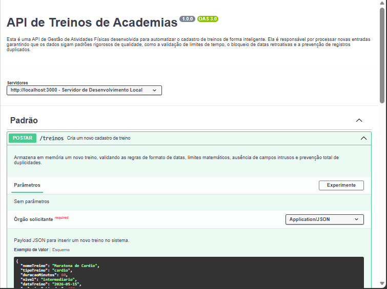
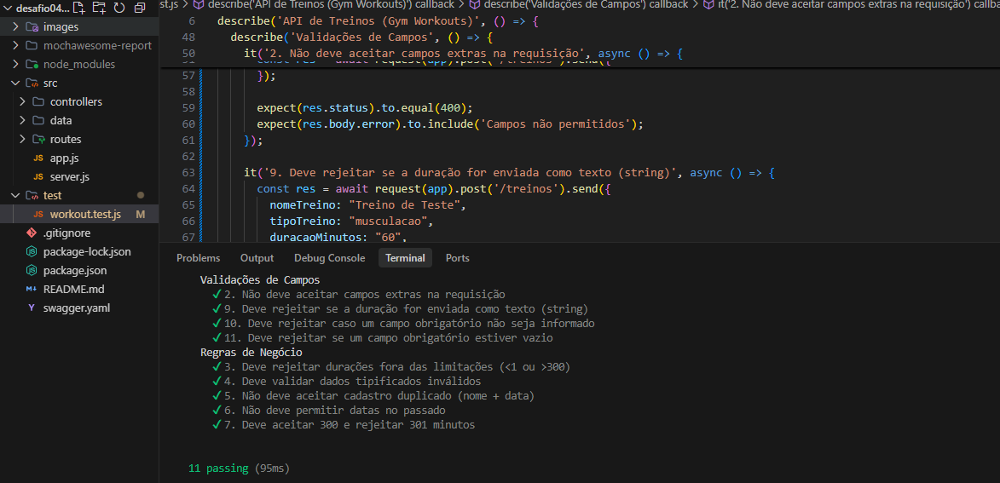
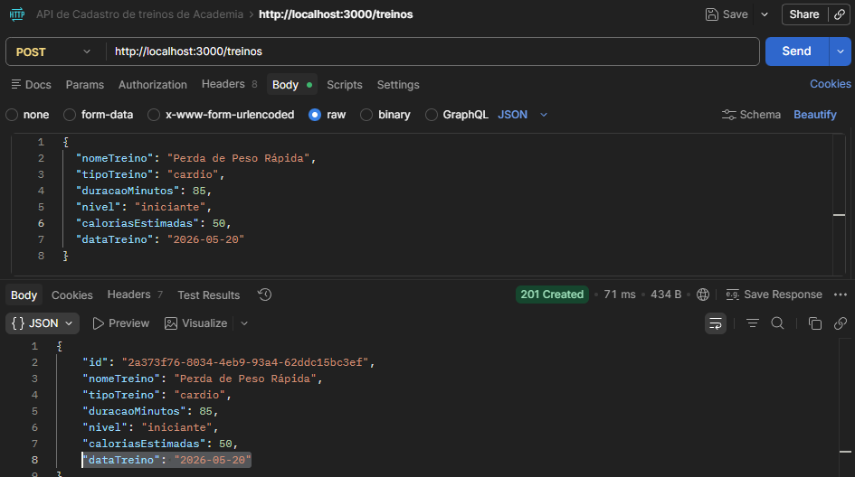
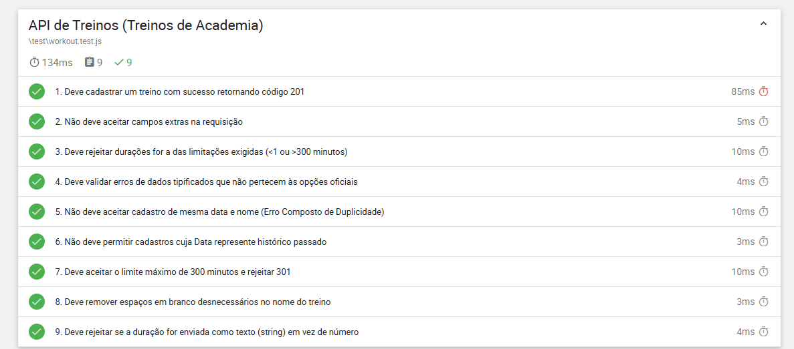

# Gym Workouts API

## Objetivo
Esta API REST foi desenvolvida em Node.js e Express como parte do meu aprimoramento na Mentoria de QA do Julio de Lima. O objetivo é o cadastro de treinos com foco em validações de regras de negócio e testes de QA.
Um diferencial deste desafio foi o uso estratégico de Inteligência Artificial (IA) para acelerar o ciclo de vida do desenvolvimento do software, neste caso o Antigravity.

---

## Documentação (Swagger)

<p align="center">
  
</p>

## Swagger

Arquivo:
```
swagger.yaml
```

Visualizar em:
https://editor.swagger.io/

---

## Regras de Negócio

- Sem campos extras (erro 400)
- Campos obrigatórios:
  - nomeTreino
  - tipoTreino
  - duracaoMinutos
  - nivel
- dataTreino:
  - Não pode ser passada
  - Deve ser válida
- Sem duplicidade (nome + data)
- duracaoMinutos:
  - 1 a 300
- caloriasEstimadas:
  - Não negativa
- tipoTreino:
  - musculacao | funcional | cardio

---

## Pré-requisitos

- Node.js
- npm

---

## Execução

### Instalar dependências
```
npm install
```

### Rodar servidor
```
npm run dev
```

Servidor:
```
http://localhost:3000
```

---

## Endpoint

```
POST /treinos
```

---

## Exemplo

```json
{
  "nomeTreino": "Treino A",
  "tipoTreino": "funcional",
  "duracaoMinutos": 30,
  "nivel": "iniciante",
  "dataTreino": "2026-10-10"
}
```

---

## Testes

```
npm test
```
<p align="center">
  
</p>

---
### Testes no Postman

<p align="center">
  
</p>

---

## Relatórios com Mochawesome

<p align="center">
  
</p>

---

## Tecnologias Utilizadas
- Linguagem: JavaScript (Node.js/Express)
- Testes: Mocha, Chai, Supertest
- Relatórios: Mochawesome
- Documentação: Swagger (YAML)
- Utilitários: UUID para IDs únicos e IA para aceleração de desenvolvimento.

## Observações

- Armazenamento em memória
- Apenas POST
- Foco em QA
